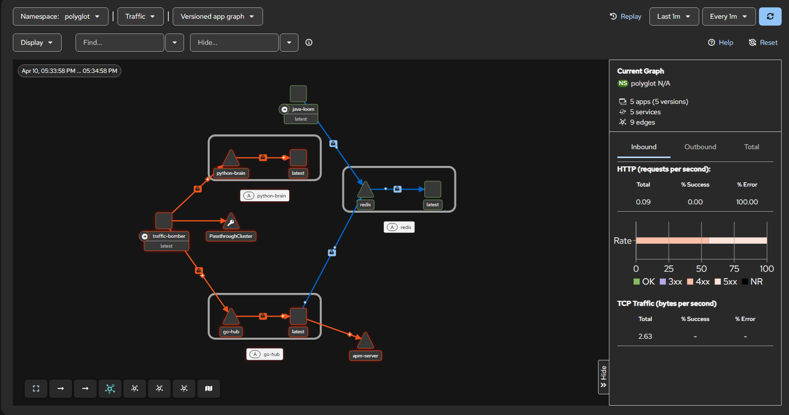

# Polyglot Infinity: Enterprise MSA Edition

**Status: [Completed]**

A real-time multi-currency micro-loan risk analysis platform built with 28 languages/runtimes and 2 databases (PostgreSQL, Redis), featuring 2 independent frontend micro-apps (Svelte 5 dashboard, Elm order terminal).

The architecture is centered on 5 core languages -- Java, Go, Python, Rust, and Svelte -- and deploys on Kubernetes with Istio service mesh and Kiali for traffic visualization, self-healing pod management, and production-grade observability.

---

## Service Map

| # | Language | Port | Key Feature |
|:-:|:---|:---:|:---|
| 1 | **Svelte 5** (SvelteKit + Bun) | 5173 | Real-time dashboard UI |
| 2 | **Go** `net/http` | 8080 | API Hub · Reverse proxy gateway (27 backends) · Redis caching · SSE stream · Circuit breaker |
| 3 | **Python** FastAPI | 8000 | FX rate collection · C++/Zig FFI · Julia HTTP |
| 4 | **Rust** Axum + sqlx | 8081 | High-performance bulk insert pipeline |
| 5 | **C++** | 8012 | `libcore.so` — Python FFI compute acceleration · HTTP artifact server |
| 6 | **Zig 0.13** | 8013 | `libzigcore.so` — Volatility estimation · VaR (C ABI) · HTTP artifact server |
| 7 | **WebAssembly** (Zig → WASM32) | 8014 | Black-Scholes Greeks · VaR · DCF · MC — nginx static server, browser-side execution |
| 8 | **Lua 5.4** | — / 8007 | Redis EVAL atomic cache counter · coroutine 6-feed scheduler |
| 9 | **Kotlin 2.0** | 9000 | Coroutine 60s risk report scheduler |
| 10 | **Elixir/Phoenix** | 4000 / 4001 | OTP Supervisor · GenServer · Phoenix Channel (port 4000) · Cowboy WebSocket raw server (port 4001) · Registry broadcast · Redis Pub/Sub → multi-client fan-out |
| 11 | **Julia 1.10** | 8002 | `Threads.@threads` GBM Monte Carlo · VaR/CVaR |
| 12 | **R 4.1** | 8003 | MLE distribution fitting · GARCH · ARIMA · Sharpe |
| 13 | **F# (.NET 8)** | 9001 | Black-Scholes Greeks · Implied Volatility · DCF |
| 14 | **OCaml 4.13** | 8004 | Rule-based risk judgment · logistic credit scoring · pattern-match loan approval · margin call escalation |
| 15 | **Crystal 1.19** | 9002 | `spawn`/`Channel` fibers — parallel FX collection from 4 sources (~1.8x) |
| 16 | **Nim 2.2.8** | 8005 | `static:` compile-time EMA/RSI tables · zero runtime divisions |
| 17 | **Scala 3** | 9003 | `enum` ADT + `LazyList.unfold` infinite stream + `given` typeclass |
| 18 | **Haskell GHC** | 8006 | Servant HTTP API · `/price` Black-Scholes Greeks (pure functional) · GBM Monte Carlo · lazy infinite stream |
| 19 | **Ruby 3.0** | 9004 | `instance_eval` runtime DSL — dynamic rule loading without restart |
| 20 | **Dart 3.11** | 9005 | Bond pricing · Duration · Nelson-Siegel yield curve |
| 21 | **Gleam 1.15** | 4001 | `wisp` + `mist` HTTP server · `ServiceMessage` ADT · exhaustive pattern match enforced at compile time |
| 22 | **V 0.5.1** | 4002 | `--gc none` Zero-GC MA crossover strategy backtester |
| 23 | **Erlang/OTP 24** | 4003 | `code:load_file/1` hot code swap · 0ms downtime |
| 24 | **Swift 6.1** | 8008 | `actor` — compile-time data race prevention |
| 25 | **Clojure 1.10** | 8009 | `ref`+`dosync` STM — lock-free atomic transfers |
| 26 | **Java 21** Project Loom | 8010 | `Executors.newVirtualThreadPerTaskExecutor()` · **Saga Pattern** — `POST /api/java/order` runs a two-phase compensating transaction: Phase 1 `INSERT status=PENDING` (committed immediately, returns 202); Phase 2 `SagaCoordinator` virtual thread calls Go gateway → Clojure STM ledger (`/api/clojure/transfer`); on HTTP 2xx → `UPDATE status=COMPLETED`; on timeout/non-2xx → compensating `UPDATE status=CANCELED` · State machine: `PENDING→COMPLETED|CANCELED`, `ORDERED→PAID→PROCESSING→SHIPPED→DELIVERED`, `CANCELED→REFUNDED` · `GATEWAY_URL` env var (default `http://server-go:8080`); per-request timeout 10 s · **PostgreSQL-only persistence** (no in-memory fallback; `DB_URL` required) · `DbStore`: `insertOrderPending()` `INSERT status=PENDING`; `updateOrderStatus()` unconditional UPDATE (Saga use only); `applyTransition()` `SELECT FOR UPDATE` state-machine transaction · HikariCP pool 20 · Virtual Thread parks on JDBC socket I/O · **Redis Pub/Sub** `order-events` (`SAGA_COMPLETE` / `SAGA_COMPENSATE` events) · Benchmark: real JDBC INSERT + PAY round-trips (virtual vs platform) |
| 27 | **SWI-Prolog 8.4** | 8011 | Declarative constraint rules → backtracking portfolio search |
| 28 | **Elm 0.19.1** (TEA) | 5174 | Order entry terminal · live Greeks (F#) · VaR (Rust) · no runtime exceptions |
| — | **APM Server** (Node.js) | 9009 | Central APM ingest · `POST /ingest` (batched `TransactionMetric`) · `GET /metrics` (p50/p95/p99/avg/max per service) · in-memory circular buffer (100k entries) |
| — | **PostgreSQL** | 5432/5433 | System logs · risk data |
| — | **Redis** | 6379 | Analytics result caching (Lua EVAL atomic ops) |

---

## Architecture

### Enterprise MSA Architecture


```
[Svelte 5 :5173]
      │ fetch / SSE / WebSocket (/ws)
      ▼
[Go Hub :8080] ── Redis :6379 (Lua EVAL cache · order-events Pub/Sub)
      │           └─ withAPM() middleware ── X-Correlation-Id inject/propagate
      │                                   └─ 8192-slot buffered chan → [APM Server :9009]
      │
      │        PUBLISH order-events ──► [Java Loom :8010] (INSERT / state transition)
      │
      ├─ [Python :8000] ── C++ cpp-core :8012 (libcore.so)
      │                 ── Zig  zig-core :8013 (libzigcore.so)
      │                 ── Julia :8002
      │
      ├─ [Rust :8081] ── PostgreSQL :5433
      │
      └─ Workflow orchestration (Python→Rust→Kotlin pipeline)
           └─ Circuit breaker (closed/open/half-open)

[Java Loom :8010] ── ApmCollector (ConcurrentLinkedQueue, apm-drain virtual thread)
                  └─ POST /ingest 500ms flush ──────────────────► [APM Server :9009]

[APM Server :9009] node:22-alpine · POST /ingest · GET /metrics · GET /health
                   circular buffer 100k entries · p50/p95/p99 per service

Standalone services: Kotlin · Elixir · R · F# · OCaml · Crystal · Nim · Scala · Haskell
                     Ruby · Dart · Gleam · V · Erlang · Lua · Swift · Clojure · Java · Prolog

[Wasm-Zig :8014] — nginx serves finance.wasm; browser fetches and instantiates (no server round-trip)

[Elm Terminal :5174] — pure TEA micro-frontend; consumes go-hub :8080, fsharp-pricer :9001, rust-pipeline :8081;
  compiled to elm.js (no runtime), served by nginx; no Node.js in the final image

All 30 containers share the "polyglot" bridge network.
Inter-service DNS: http://<service-name>:<port>/ (e.g. http://risk-ocaml:8004)

Reverse proxy routes registered on Go Hub (:8080):
  Canonical (language prefix)     Role alias (service name)
  /api/python/   -> :8000         /api/risk/       -> ocaml-risk  :8004
  /api/rust/     -> :8081         /api/pricer/     -> fsharp-pricer:9001
  /api/julia/    -> :8002         /api/analytics/  -> nim-analytics:8005
  /api/r/        -> :8003         /api/ledger/     -> clojure-stm :8009
  /api/fsharp/   -> :9001         /api/scheduler/  -> kotlin-sched:9000
  /api/ocaml/    -> :8004
  /api/crystal/  -> :9002
  /api/nim/      -> :8005
  /api/scala/    -> :9003
  /api/haskell/  -> :8006
  /api/ruby/     -> :9004
  /api/dart/     -> :9005
  /api/gleam/    -> :4001
  /api/v/        -> :4002
  /api/erlang/   -> :4003
  /api/elixir/   -> :4000
  /api/clojure/  -> :8009
  /api/java/     -> :8010
  /api/prolog/   -> :8011
  /api/lua/      -> :8007
  /api/swift/    -> :8008
  /api/kotlin/   -> :9000
```

---

## Key APIs (Go Hub :8080)

| Method | Endpoint | Description |
|:---|:---|:---|
| GET | `/api/status` | Overall system status |
| GET | `/api/aggregate` | Parallel health check aggregation across 28 backends |
| GET | `/api/aggregate/stream` | **SSE** — real-time service status stream |
| GET | `/api/report` | Consolidated risk report (includes DB stats) |
| GET | `/api/workflow/risk-full` | Python→Rust→Kotlin end-to-end pipeline |
| GET | `/api/workflow/option-compare` | F# · Haskell · Python 3-engine BS price comparison |
| GET | `/api/circuit/status` | Circuit breaker status |
| GET | `/api/cache/stats` | Redis Lua EVAL cache hit/miss stats |
| ANY | `/api/<lang>/*` | **Reverse proxy** — 22 canonical language routes forwarded to backend container |
| ANY | `/api/risk/*` | Role alias → `ocaml-risk:8004` |
| ANY | `/api/pricer/*` | Role alias → `fsharp-pricer:9001` |
| ANY | `/api/analytics/*` | Role alias → `nim-analytics:8005` |
| ANY | `/api/ledger/*` | Role alias → `clojure-stm:8009` |
| ANY | `/api/scheduler/*` | Role alias → `kotlin-scheduler:9000` |
| POST | `/api/java/order?id=<id>&type=BUY\|SELL[&from=ACC-001&to=ACC-002&amount=100.0]` | **Saga** — Phase 1: `INSERT status=PENDING` (202 Accepted, immediate); Phase 2 async: calls Clojure STM ledger via Go gateway; success → `COMPLETED`, failure/timeout → `CANCELED` (compensating transaction) |
| PUT | `/api/java/order?id=<id>&event=<evt>` | Order state transition — `PAY`, `PROCESS`, `SHIP`, `DELIVER`, `CANCEL`, `REFUND` (DB `SELECT FOR UPDATE` transaction) |
| GET | `/api/java/order?id=<id>` | Get order by ID (live DB read) |
| GET | `/api/java/orders` | Get all orders (ordered by `created_at DESC`) |
| GET | `/api/java/benchmark?n=<N>&mode=virtual\|platform\|both` | Virtual Thread vs Platform Thread throughput benchmark |
| WS | `/ws` | WebSocket — streams `order-events` Redis Pub/Sub channel to all connected clients |

---

## DB Schema

```sql
-- system_logs (Go · polyglot_db)
CREATE TABLE system_logs (
    id SERIAL PRIMARY KEY, source TEXT, message TEXT,
    created_at TIMESTAMP DEFAULT CURRENT_TIMESTAMP
);

-- risk_logs (Rust · postgres :5433)
CREATE TABLE risk_logs (
    id SERIAL PRIMARY KEY, user_id INT, risk_score FLOAT,
    created_at TIMESTAMP DEFAULT CURRENT_TIMESTAMP
);

-- risk_reports (Kotlin · postgres :5433)
CREATE TABLE risk_reports (
    id SERIAL PRIMARY KEY, generated_at TIMESTAMP DEFAULT CURRENT_TIMESTAMP,
    avg_risk_score FLOAT, total_records INT, max_risk_score FLOAT, min_risk_score FLOAT
);

-- orders (Java Loom · db-postgres :5432, auto-created on startup)
CREATE TABLE IF NOT EXISTS orders (
    id         VARCHAR(255) PRIMARY KEY,
    type       VARCHAR(8)   NOT NULL DEFAULT 'BUY',  -- BUY | SELL
    status     VARCHAR(32)  NOT NULL,
    created_at BIGINT       NOT NULL,
    updated_at BIGINT       NOT NULL
);
```

---

## CI / CD

| Item | Value |
|:---|:---|
| Workflow file | `.github/workflows/main.yml` |
| Trigger | `push` to `main`, `pull_request` targeting `main` |
| Runner | `ubuntu-latest` |
| Job | `build` (single job, `timeout-minutes: 90`) |

**Steps executed on every run**

1. `actions/checkout@v4` — full repository checkout.
2. Free runner disk space — removes `/usr/share/dotnet`, Android SDK, GHC, CodeQL toolchains; prunes stale Docker images.
3. `docker/setup-buildx-action@v3` — enables Buildx (required for `dockerfile_inline` in `cpp-core` and `zig-core`).
4. `docker compose config --quiet` — validates `docker-compose.yml` syntax and schema before any build attempt.
5. `actions/cache@v4` — restores BuildKit layer cache keyed on commit SHA.
6. `docker compose build --parallel` — builds the 6 services with explicit Dockerfiles: `go-hub`, `python-brain`, `rust-pipeline`, `cpp-core`, `zig-core`, `terminal-elm`.
7. `docker compose pull --ignore-buildable` — pulls registry images for the remaining 22 application services and 3 infrastructure services.
8. `docker compose up --no-start` — creates all containers without starting them; fails if any image cannot be resolved.
9. Container count assertion — `docker compose ps -a --quiet | grep -c .` must be >= 28; exits 1 otherwise.
10. `docker compose down --remove-orphans` — cleanup (always runs).

---

## APM Endpoints

| Method | Endpoint | Description |
|:---|:---|:---|
| POST | `/ingest` | Accept JSON array of `TransactionMetric` objects; 202 Accepted |
| GET | `/metrics?limit=N` | Per-service p50/p95/p99/avg/max latency + most recent N events (default 100) |
| GET | `/health` | Liveness probe: `{ status, buffered }` |

**`TransactionMetric` schema**
```json
{
  "correlationId": "3f2a1b4c-...",
  "service":       "go-hub",
  "endpoint":      "/api/java/order",
  "responseMs":    12,
  "queryMs":       8,
  "timestamp":     1712700000000
}
```

---

## Changelog

### 2026-04-10

**K8s migration: direct image load and DB environment variable injection** (`k8s/`, `loom-java/`, `portal-svelte/`)

- Built `java-loom:latest` and `svelte-portal:latest` images directly inside the Minikube Docker daemon using `eval $(minikube docker-env)` to ensure images are available on the node without requiring a remote registry.
  - `java-loom:latest` -- `eclipse-temurin:21-jdk-alpine` base; compiled output from `loom-java/out/` and `loom-java/libs/` copied in; startup command: `java -cp '/app/out:/app/libs/*' VirtualServer`.
  - `svelte-portal:latest` -- `node:22-alpine` base; `portal-svelte/` source copied in; startup command: `npm install && npm run dev -- --host 0.0.0.0`.
- Injected all required environment variables into running Deployments via `kubectl set env`:
  - `java-loom`: `DB_URL`, `DB_USER`, `DB_PASSWORD`, `REDIS_HOST`, `REDIS_PORT`, `APM_URL`.
  - `go-hub`: `DATABASE_URL`, `REDIS_URL`, `APM_URL`.
  - `rust-pipeline`: `DATABASE_URL`, `REDIS_URL`.
- Created missing ClusterIP Services for infrastructure dependencies: `db-postgres:5432`, `postgres:5432`, `redis:6379`.
- All 5 core pods confirmed `2/2 Running` (Envoy sidecar injected by Istio): `go-hub`, `java-loom`, `python-brain`, `rust-pipeline`, `svelte-portal`.

**K8s manifest generator fixes** (`tools/k8s-generator.py`, `k8s/`)

- Added `imagePullPolicy: IfNotPresent` to all generated container specs to prevent unnecessary remote pull attempts for locally-built images.
- Generator now emits `command` and `args` from docker-compose `entrypoint` and `command` fields respectively; string values are tokenized with `shlex.split`.
- `tty: true` and `stdin: true` are set on container specs where `tty: true` is present in the compose definition.
- All 32 manifests under `k8s/` regenerated with the updated script.

---

### 2026-04-09

**APM infrastructure** (`apm-server/`, `loom-java/`, `server-go/`)

- `apm-server/server.js` -- Node.js APM ingestion server on port 9009; `POST /ingest` (100k-entry circular buffer), `GET /metrics` (p50/p95/p99/avg/max per service), `GET /health`.
- `loom-java/ApmCollector.java` -- Non-blocking APM collector using `ConcurrentLinkedQueue`; single `apm-drain` virtual thread drains up to 200 events every 500 ms.
- `server-go/main.go` -- `withAPM()` middleware injects `X-Correlation-Id` and enqueues events via an 8192-slot buffered channel; `startAPMDrainer()` goroutine flushes every 500 ms.
- `docker-compose.yml` -- `apm-server` service added; `go-hub` and `java-loom` gain `APM_URL` env var and `depends_on` entry.

**Java Loom -- Saga Pattern** (`loom-java/VirtualServer.java`)

- Implemented a two-phase compensating transaction: Phase 1 `INSERT status=PENDING` (202 Accepted, immediate); Phase 2 async via `SagaCoordinator` virtual thread calls Clojure STM ledger; HTTP 2xx transitions to `COMPLETED`, timeout or non-2xx triggers compensating `UPDATE` to `CANCELED`.
- Redis `order-events` publishes `SAGA_COMPLETE` or `SAGA_COMPENSATE` on resolution.

**Istio service mesh and Kiali visualization** (`deploy-mesh.sh`)

- `deploy-mesh.sh` -- Automates namespace creation with `istio-injection=enabled` label and applies all manifests under `k8s/` to the `polyglot` namespace.
- Kiali accessible via `kubectl port-forward svc/kiali 20001:20001 -n istio-system` at `http://localhost:20001/kiali`.

**K8s manifest generator** (`tools/k8s-generator.py`, `k8s/`)

- `tools/k8s-generator.py` -- Generates Kubernetes `Deployment` and `ClusterIP` `Service` manifests from `docker-compose.yml` using `pyyaml`; 32 manifests written to `k8s/`.

**Chaos testing scripts** (`chaos.sh`, `k8s-chaos.sh`)

- `chaos.sh` -- Docker Compose chaos monkey; kills and restarts a random backend container every 10 s to validate circuit breaker behavior.
- `k8s-chaos.sh` -- Kubernetes chaos monkey; force-deletes a random running pod in the `polyglot` namespace every 10 s to validate ReplicaSet self-healing.

---

### 2026-04-08

**Java Loom -- HikariCP PostgreSQL persistence** (`loom-java/`)

- Full JDBC rewrite of `VirtualServer.java`; all in-memory state removed. `DbStore` inner class uses HikariCP pool (maxPool=20); `SELECT FOR UPDATE` state-machine transactions; `DB_URL` absence causes `System.exit(1)`.
- Orders table extended with `type VARCHAR(8) NOT NULL DEFAULT 'BUY'`.

**Event-driven WebSocket pipeline** (`server-go/`, `loom-java/`, `portal-svelte/`)

- Go Hub `GET /ws` endpoint upgrades to WebSocket; `startRedisSubscriber()` forwards `order-events` Pub/Sub channel to all connected clients via a gorilla/websocket Hub.
- Java Loom publishes order creation and state transition events to Redis `order-events`.
- Svelte portal displays a live Order Event Feed panel with a 50-event ring buffer and 3 s auto-reconnect.

**Elm Order Terminal** (`terminal-elm/`)

- Full TEA implementation; consumes `go-hub`, `fsharp-pricer`, and `rust-pipeline`; compiled to `elm.js` with no runtime exceptions by design; served by nginx.

**Go Gateway -- circuit breaker hardening** (`server-go/main.go`)

- All 27 proxy routes wrapped with `newCBProxy`; per-request 5 s context deadline; `writeFallback` returns `200 {"status":"degraded"}` instead of 504 to avoid error propagation during cold-start bursts.

---

### 2026-04-07

Docker Compose 28-service stack; Go workflow orchestration and circuit breaker; R GARCH/ARIMA; Nim compile-time tables; OCaml multi-asset VaR; WASM Monte Carlo and portfolio; Elixir Redis Pub/Sub; Svelte tabs, notifications, charts, and dependency-map panels.

---

### 2026-04-06

SWI-Prolog (28th language); Lua coroutines; Swift Actor; Clojure STM; Java Loom; Erlang hot-swap; V Zero-GC; Ruby DSL; Gleam ADT; Scala 3; Nim; Crystal; OCaml; Dart; Haskell; R; F#; WebAssembly.

---

### 2026-03-18

Rust pipeline; Docker PostgreSQL integration.

---

### 2026-02-14

Project initialized: SvelteKit, Go, Python, Rust, C++.

